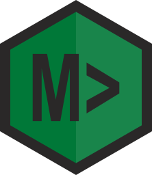

# Mitech CLI
<div align="center">



Mitech S.r.l. utility CLI tool.

Questo pacchetto fornisce il comando **mitech**, utility ad uso interno di Mitech S.r.L.

</div>
<hr>

## Prerequisiti
E' richiesto l'uso di Node 12 o superiore

## Installazione
```shell
git clone https://github.com/mitechsrl/mitech-cli.git
npm install
npm link
```
## Run
Digita **mitech** in console per vedere l'help.

## Comandi

**Nota help**: Aggiungendo in **qualsiasi** comando il parametro **-h**, la cli mostra l'help per quel comando, saltando l'esecuzione dello stesso. Vengono anche mostrati eventuali sottocomandi con loro descrizioni.

### mitech pm2
Proxy verso PM2 remoto. Digita un qualsiasi comando dopo *pm2* ed esso viene eseguito su un target remoto.
Vedi [documentazione pm2](https://pm2.io/docs/runtime/reference/pm2-cli/) su comandi utilizzabili.

**esempio**
```mitech pm2 logs``` esegue il comando ```pm2 logs``` su un target remoto via ssh e ne mostra il risultato

### mitech cscli
Proxy verso cscli remoto. Digita un qualsiasi comando dopo *cscli* ed esso viene eseguito su un target remoto.
Vedi [documentazione cscli](https://docs.crowdsec.net/docs/cscli/cscli/#see-also) su comandi utilizzabili.

**esempio**
```mitech cscli alerts``` esegue il comando ```cscli alerts``` su un target remoto via ssh e ne mostra il risultato


### mitech git merged
Verifica lo stato di merge di una branch specifica all'interno del repository locale

### mitech git unmerged
Visualizza la lista di branch non ancora mergiate nel repository locale

### mitech git updated
Visualizza la lista di commit eseguite dall'ultimo tag. Se non vi sono commit, signigica che la build corrispondente al tag selezionato contiene tutte le modifiche e non è necessario rieseguire una ulteriore build

### mitech workspace create
Crea un workspace npm alla directory corrente.

### mitech ssh connect
Avvia una sessione ssh interattiva verso un [target](#concetto-del-target) selezionato. E' neessario eseguire questo comando all'interno di una directory contenente un file [.mitechcli](#file-mitechcli)

### mitech ssh targets add
Crea un target nel file [.mitechcli](#file-mitechcli) alla directory corrente

### mitech npm registry
Mostra la lista di registy npm configurati

### mitech npm registry add
Mostra prompt interattivo per aggiungere un registry npm

### mitech npm registry delete
Mostra prompt interattivo per eliminare un registry npm

### mitech npm publish
Pacchettizza la directory locale e pusha il tutto su un registry configurato.

### mitech npm delete
Elimina un pacchetto da un registry configurato

ATTENZIONE: Eliminando il pacchetto, eventuali oeprazioni di ```npm install``` che dipendono da tale pacchetto falliranno in quanto non troveranno piu il pacchetto!

### mitech npm authorize
Crea nella directory corrente il file **.npmrc** che permette l'autenticazione verso il repository privato mitech

### mitech npm add-dep
Utility chiamabile automaticamente per aggiornare la dipendenza di un determinato pacchetto in un determinato file package.json. Tutti i valori sono passabili come parameri argv, digita **mitech npm add-dep -h** per piu info.

### mitech vm pre-setup
Verifica che l'utenza **username** specificata nel file [.mitechcli](#file-mitechcli) abbia i permessi necessari all'esecuzione dei comandi di setup VM. 

### mitech vm download
Copia un file da un [target](#concetto-del-target) remoto alla macchina locale.

### mitech vm maintenance enable
Attiva la modalità maintenance di un [target](#concetto-del-target) remoto.

Quando un server è in modalità manutenzione, nginx mostra una pagina placeholder a tutti i clients eccetto quelli provenienti dai seguenti ip:
- ip connessione di chi ha eseguito il comando
- ip server vpn mitech

NOTA 1: E' richiesta configurazione specifica di nginx, creata in automatico nei setup piu recenti. I setup piu vecchi richiedono verifica ed eventuale update per supportare questa modalità.

NOTA 2: la pagina web caricata e mostrata all'utente è modificabile, i files risiedono nella directory **src\bin\vm\maintenance\enable\_html_files**

NOTA 3: Il comando abilita la modalità manutenzione sia per environments pm2 che docker. Si avvale del valore definito in **.mitechcli.json** per sapere quale setup eseguire.

### mitech vm maintenance disable
Disattiva la modalità manutenzione. Valido sia per environments pm2 che docker.

### mitech vm os
Visualizza sistema operativo di un [target](#concetto-del-target) remoto.

### mitech vm reboot
Esegue reboot del [target](#concetto-del-target) remoto.

### mitech vm setup node
Esegue setup dell'environment node su un [target](#concetto-del-target) remoto.

Tipicamente questo corrisponde a:
- install node
- install+setup nginx
- install pm2
- creazione utente dedicato a apps node (username onit tipicamente)

### mitech vm setup docker
Esegue setup dell'environment docker su un [target](#concetto-del-target) remoto.

Corrisponde a:
- install docker
- install node (solo per uso e consumo di script interni)
- creazione utente dedicato (username onit tipicamente)

### mitech vm setup mongodb
Esegue setup mongodb su [target](#concetto-del-target) remoto.

Questa operazione esegue tipicamente:
- install+setup mongodb
- creazione di un user amministratore "admin" e uno dedicato alle app node con permessi piu limitati
  
### mitech vm setup redis
Esegue setup redis su [target](#concetto-del-target) remoto.

Questa operazione esegue tipicamente:
- install redis
- abilitazione autenticazione con set password in config redis
  
### mitech vm setup datadisk
Esgue setup di un disco dati aggiuntivo su [target](#concetto-del-target) remoto.

NOTA: Il disco deve essere già connesso alla macchina, si rimanda alla documentazione Azure su [come aggiungere un disco dati gestito](https://learn.microsoft.com/it-it/azure/virtual-machines/windows/attach-managed-disk-portal#add-a-data-disk). La parte di inizializzazione è automatizzata da qesto comando.

### mitech vm setup crowdsec
Esegue setup di crowdsec su [target](#concetto-del-target) remoto.

### mitech vm setup certbot
Attiva SSL su [target](#concetto-del-target) remoto tramite certbot. I certificati certbot sono gratuiti e di validità trimestrale, rinnovati automaticamente.

Vedi [Certbot](https://certbot.eff.org/) per maggiori info

### mitech vm shutdown
Esegue shutdown del [target](#concetto-del-target) remoto.

NOTA AZURE: Questo comando non dealloca la macchina, pertanto non è seguita da una sospensione dei costi. Per sospendere i costi, occorre stoppare la macchina via web su [https://portal.azure.com](https://portal.azure.com)

### mitech vm uptime
Mostra uptime di un [target](#concetto-del-target) remoto. 

### mitech deploy app
Esegue il deploy dell'app NodeJS alla directory corrente su un [target](#concetto-del-target).

NOTA: L'app deve essere descritta nel corrispettivo file **ecosystem.conig.json** altrimenti non verrà avviata. Si consiglia pertanrto di eseguire questo comando DOPO il deploy del file pm2.

### mitech deploy docker
Esegue deploy di applicazioni docker.

NOTA: Il comando deve essere eseguito in una directory con file **docker-compose.yml**.

### mitech deploy backups list
Visualizza la lista di backup di apps disponibili su [target](#concetto-del-target) remoto.

NOTA BACKUP: Il backup di una app viene eseguita in fase di deploy, subito prima del caricamento della nuova app.
Il backup contiene tutta la directory dell'app caricata, inclusa directory node_modules, pertanto per un futuro restore è sufficiente scompattare il file nella directory di destinazione senza dover rieseguire npm install.

### mitech deploy backups restore
Esegue il restore di un backup di un app su [target](#concetto-del-target) remoto.

### mitech deploy file
Copia files o directories su [target](#concetto-del-target) remoto.
Per default, il comando copia i files nella directory delle apps node. Usa i parametri di questo comando per personalizzare le directory di copia.

### mitech deploy pm2
Copia il file ecosystem.config.json su  [target](#concetto-del-target) remoto.

Per default non viene eseguito nessun riavvio delle app descritte nel file, se necessario utilizzare i parametri del comando per farlo.

### mitech deploy project
Esegue il deploy multiplo di un progetto, automatizzando il deploy di più app su più [targets](#concetto-del-target) remoti.

Questo comando necessita della configurazione **projects** nel [file .mitechcli](#file-mitechcli). Vedi sezione [projects](#projects) per maggiori info

### mitech db dump
Esegue dump di un database. Necessita di configurazione **dbs** nel file [file .mitechcli](#file-mitechcli). Vedi sezione [dbs](#dbs) per maggiori info.

Attualmente supportato: mongodb.

Per il dump di mongodb il tool scarica in automatico e silentemente mongotools, pertanto non vi sono dipendenze particolari da insallare

### mitech db restore local
Esegue restore di un database (precedentemente "dumpato" via *mitech db dump*) **con destinazione l'istanza locale del dbms**. Necessita di configurazione **dbs** nel file [file .mitechcli](#file-mitechcli). Vedi sezione [dbs](#dbs) per maggiori info.

Attualmente supportato: mongodb.

Per il restore di mongodb il tool scarica in automatico e silentemente mongotools, pertanto non vi sono dipendenze particolari da insallare.

## Concetto del target

Gran parte dell'ecosistema si basa su controllo remoto tramite ssh. Target identifica quindi il server remoto verso il quale eseguire la connessione ssh e i comandi stessi.

La cli gestisce i targets tramite un file [.mitechcli](#file-mitechcli) che può essere creato in una qualsiasi cartella. All'interno di questo file la cli va a inseire una struttura come segue:

```
{
    targets:[{                 
        name: string,
        host: string,
        ...
    },{                 
        name: string,
        host: string,
        ...
    }]
}
```

ogni qualvolta si lancia la cli in una directory contenente un file simile, viene mostrata la selezione del target voluto tra quelli listati nel file. Nel caso esista un solo target, la cli usa in automatico quello.

La lista dei targets usabili può essere visualizzata con **mitech ssh targets**

Per aggiungere un target oppure creare un file ex-novo, usa **mitech ssh targets add**

## Encrypt locale password
La cli memorizza le password in modo criptato all'interno dei file [.mitechcli](#file-mitechcli), in modo da non avere password in chiaro su filesystem.
La password per il crypt/decrypt viene gestita tramite vaiabili di ambiente, in modo da facilitare l'utente nell'esecuzione dei comandi.

Inserire nelle variabili di ambiente dell'utente corrente (tramite utility dedicata del proprio OS) la chiave **MitechCliEncryptionKey** valorizzata con una propria password.

NOTA 1: se si presentano problematiche di case sensitivity, **process.env.MITECHCLIENCRYPTIONKEY** e **process.env.mitechcliencryptionkey** vengono altresi riconosciute.

NOTA 2: Se si vuole utilizzare la password custom, crearla il prima posibile poichè se cambiata DOPO averla già utilizzata per codificare valori, si perde l'abilità di decodifica su credenziali vecchie.

## File .mitechcli
Il file .mitchcli permette la configurazione di alcuni comandi.

La cli accetta diversi formati e filenames per questo file:
- **.mitechcli.json**: file testuale contenente un oggetto json
- **.mitechcli**: come mitechcli.json
- **.mitechcli.js**: file javascript, deve esportare come unico elemento un oggetto json ```module.exports = {...}```.

La cli verifica la presenza del file nelle directory (rispettivamente, in ordine di precedenza) di esecuzione, padre e nonno.

Il file può essere creato in automatico (ad esempio tramite mitech ssh targets add), e presenta una struttura simile a

```json
{   
    "projects": [], // vedi sotto
    "targets": [], // vedi sotto,
    "dbs":[] // vedi sotto
}
```
### Nota su staging/commit

Tale file potrebbe contenere valori dipendenti dall'environment locale (come ad esempio path di chiavi ssh) pertanto è pressochè proibito il commit di tale file eccetto il caso in cui non vi siano tali dipendenze (in caso contrario chi fa pull riceverebbe files con path molto probabilmente invalidi sul proprio pc).

Prestare attenzione caso per caso alla fatibilità o meno della cosa.
### targets
Array di oggetti, ognuno dei quali definisce un [target](#concetto-del-target) configurato in questa directory. Ogni target segue la struttura definita come:
```json
{
    "name": "some-db-server", // stringa generica
    "host": "name.server.com", // hostname del server remoto 
    "port": 22, // porta ssh
    "username": "server-username", // server username. Deve supportare sudo senza password.
    "accessType": "sshKey", // sshKey oppure password
    "sshKey": "file.pem", // necessario solo se accessType = "sshKey"
    "password":{
        // oggetto definizione password, necessario solo se accessType="password". E' oggetto criptato, vedi "#Encrypt locale password". Non si specifica come creare l'oggetto manualmente, crearlo tramite "mitech ssh tragets add"
    },
    "nodeUser": "onit", // user processi onit
    "activate": false // Non ricordo a cosa serve?????
    "environment":"pm2" // oppure "docker". Determina che tipo di environment è installato su server, per eseguire comandi di conseguenza.
},
```

#### projects

Projects permette di configurare il comando *mitech deploy project*.

Ogni elemento dell'array presenta la seguente struttura:

```json
{
    // nome arbitrario mostrato in fase di selezione iniziale. Non è legato al nome dell'app, può anche essere "pippo"
    "name": "onit-next",
    
    // versione hardcodata di --uptime-check onitVersion
    // uptimeCheck: 'onitVersion',

    // dipendenze globali. Queste vengono aggiunte ai package.json dei vari deployments.
    // Stessa sintassi di dependencies in package.json
    "commonDependencies": {
        "express": "4.18.1"
    },
    // Lo script chiede quali di questi deploy eseguire. Se si seleziona "tutti", vengono eseguiti tutti in sequenza.
    // L'ordine è quello in cui compaiono qui.
    // Le chiavi di questo oggetto sono nomi arbitrari, non è necessario che eseguano match con altri valori
    "deployments": {
        "deployment1": {
            // Nome del target da utilizzare per la connessione ssh.
            // Deve eseguire match letterale con i nomi definiti nell'array targets del file .mitechcli
            "target": "vm local",
            "dependencies": {
                // opzionali. Stessa sintassi di dependencies in package.json
                // dipendenze specifiche. Queste vengono aggiunte al package.json presente in "path".
                // Sovrascrivono eventuali commonDependencies
                "debug": "4.3.4"
            },
            // path dell'app da deployare. Questa directory contiene il package.json + eventuali files da caricare sul server
            "path": "./deployment1/onit-next"
        },
        "deployment2": {
            "target": "vm local",
            "path": "./deployment2/onit-next"
        }
    }
}
```

Vedi la issue da cui è nata l'implementazione di questo comando per altre info: [https://github.com/mitechsrl/onit-next/issues/40](https://github.com/mitechsrl/onit-next/issues/40)

Vedi un esempio di configurazione attiva nel depoloyment di prodocu: [https://github.com/mitechsrl/onit-prodocu-deployment/blob/Onit-V4/.mitechcli.js](https://github.com/mitechsrl/onit-prodocu-deployment/blob/Onit-V4/.mitechcli.js)

#### dbs
Array di definizione dei database per abilitare l'uso dei comandi **mitech db dump** e **mitech db restore**.

Ogni elemento dell'array mantiene una struttura pari a:

```json
{
    "type": string, // Tipo di dbms. Ad ora supportato solo 'mongodb'
    "name": string, // nome di questo db. Sringa arbitraria.
    "host": string, // hostname del server su cui è attiva l'istanza mongo a cui connettersi
    "port": string, // opzionale, defaults 27017
    "username": string,  // opzionale, se omessa non avviene autenticazione
    "password": string, // opzionale, se omessa non avviene autenticazione. TODO: encrypt
    "tls": boolean, // opzionale, se true usa tls per la connessione mongo
    "databaseNames": string[], // opzionale, lista di database names da dumpare. Se omessa o lista vuota processa "tutti i db"
    "dst": string // opzionale, directory destinazione dump, default ./
};
```

## Aggiungere comandi
La cli è fatta in modo da caricare dinamicamente come comandi i nomi delle cartelle presenti in bin/

esempio:
- **mitech publish** esegue la configurazione definita in **/bin/publish/commandConfig.ts**
- **mitech publish test** esegue la configurazione definita in  **/bin/publish/test/commandConfig.ts**
- **mitech publish test -p 1 -c 3 -d 4** esegue la configurazione definita in  **/bin/publish/test/commandConfig.ts** passando alla funzione di **exec** l'oggetto **argv** pari a ```{p:1,c:3, d:4}```

Per creare un nuovo comando è quindi necessario creare una cartella in **/bin/path/del/comando** e inserire in esso un file **commandConfig.ts** che abbia la seguente struttura:

```js
import { Command } from '../../types';

// src\types\command.ts
const config: Command = {
    description: 'Utility gestione target remoti pm2',
    exec: './exec', // file da eseguire al lancio del comando. Corrisponde a exec.ts
    longHelp:'Mostrami come body du quando l\'utente usa -h',
    params: [] // Array di parametri CMD da gestire. Vedi command.ts per info
};

export default config;
```

Aggiungere quindi il file definito alla proprietà **exec** del file **commandConfig.ts** (exec.ts in questo caso)

```js
import yargs from 'yargs';
import { logger } from '../../lib/logger';
import { CommandExecFunction } from '../../types';

const exec: CommandExecFunction = async (argv: yargs.ArgumentsCamelCase<unknown>) => {
    // argv contiene i parametri processati.
    // Inserire qui la propria implementazione 
    logger.warn('Sono stato eseguito');
};

//export funzione come default per essere chiamata dal gestore dei comandi.
export default exec;
```

Una volta aggiunto i comando, esegui ```npm run build``` per eseguire la build typescript.

Committa anche i files nella directory dist, in modo da non dover rendere obbligatoria una build agli utenti utilizzatori (eseguendo pull si trovano i files della build già aggiornati)

## Howto's

### Da server nuovo, senza nulla di installato, ad app deploy
Presupposti:

- Si ha a disposizione un file di pm2 ecosystem.config.json e una app node, nella struttura:
    ```
    - ecosystem.config.json
    - hello-world-app
       - package.json
       - index.json
    ```
    e si è posizionati, con la cli locale, nella cartella contenente *ecosystem.config.json*. Si suppone che il file ecosystem.config.pm2 sia opportunamente valorizzato

- Si ha a disposizione hostname e credenziali di root del server in questione

Digitare quindi i seguenti comandi per installare l'ambiente node ed eseguire il deploy di una app node:

```
mitech ssh targets add // aggiungi target rispondendo alle domande del cli
mitech vm pre-setup // verifica eventuali problemi da risolvere manualmente prima di eseguire il setup 
mitech vm setup node // installa ambiente node su server. Seguire le domande a prompt
mitech vm setup crowdsec // installa crowdsec sul server. 
mitech vm setup mongodb // installa mongodb su server. Seguire le domande a prompt
mitech deploy pm2 // carica il file ecosystem.config.js senza fare nient'altro
cd hello-world-app
mitech deploy app // carica l'app hello-world-app e la avvia (o riavvia se già presente)
```


## Licenza
Questo pacchetto è distribuito sotto licenza [WFTPL](./LICENSE), [http://www.wtfpl.net/](http://www.wtfpl.net/). 
